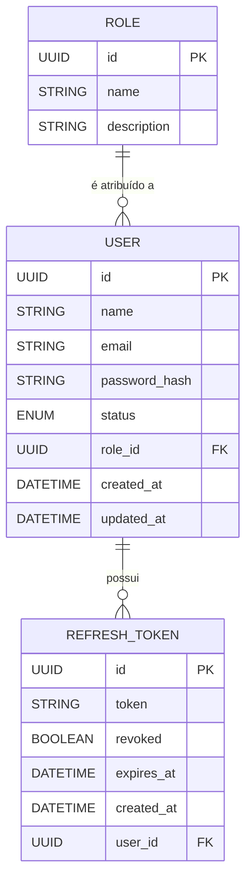

# 📑 Índice

1. [📝 Visão Geral](#visao-geral)
   - [🎯 Objetivo](#objetivo)
   - [📌 Responsabilidades](#responsabilidades)
   - [🚫 Fora do Escopo](#fora-do-escopo)

2. [🗄️ Modelo de Dados](#modelo-de-dados)
   - [📖 Visão Geral](#modelo-visao-geral)
   - [📊 Modelo Conceitual](#modelo-conceitual)
   - [🏛️ Entidades](#entidades)
     - [👤 User](#user)
     - [🛡️ Role](#role)
     - [🔄 Refresh Token](#refresh-token)
   - [🔗 Relacionamentos](#relacionamentos)
   - [📐 Regras de Modelagem](#regras-de-modelagem)

3. [🔐 Autenticação](#autenticacao)
   - [🔑 Login](#login)
   - [♻️ Refresh Token](#refresh-token-endpoint)
   - [🚪 Logout](#logout)

4. [👥 Usuários](#usuarios)
   - [➕ Criar Usuário](#criar-usuario)
   - [📋 Listar Usuários](#listar-usuarios)
   - [🔍 Buscar Usuário](#buscar-usuario)
   - [✏️ Atualizar Usuário](#atualizar-usuario)
   - [🔄 Alterar Status do Usuário](#alterar-status-do-usuario)

5. [🛡️ Papéis (Roles)](#papeis)
   - [📖 Tipos de Papéis](#tipos-de-papeis)

6. [🎫 JWT (JSON Web Token)](#jwt)

---

<a id="visao-geral"></a>

# 📝 Visão Geral

<a id="objetivo"></a>

## 🎯 Objetivo

A Identity Service é responsável pelo gerenciamento da identidade dos usuários da plataforma.

Suas principais responsabilidades incluem autenticação, emissão e renovação de tokens JWT, gerenciamento de usuários e controle de acesso baseado em papéis (RBAC), fornecendo os mecanismos de segurança utilizados pelos demais microsserviços.

---

<a id="responsabilidades"></a>

## 📌 Responsabilidades

A Identity Service é responsável por:

- Autenticar usuários.
- Emitir Access Tokens (JWT).
- Emitir e renovar Refresh Tokens.
- Revogar Refresh Tokens durante o logout.
- Gerenciar usuários da plataforma.
- Gerenciar os papéis atribuídos aos usuários.
- Fornecer informações de identidade para os demais microsserviços.

---

<a id="fora-do-escopo"></a>

## 🚫 Fora do Escopo

A Identity Service não é responsável por regras de negócio dos demais microsserviços, incluindo:

- Cadastro de clientes.
- Análise de crédito.
- Auditoria.
- Notificações.
- Gerenciamento de dados financeiros.
- Processamento de solicitações de crédito.


<a id="modelo-de-dados"></a>

# 🗄️ Modelo de Dados

<a id="modelo-visao-geral"></a>

## 📖 Visão Geral

O modelo de dados da Identity Service foi projetado para atender exclusivamente às necessidades de autenticação, autorização e gerenciamento de usuários da plataforma.

O microsserviço é composto por apenas três entidades:

- **User**: representa um usuário autenticável.
- **Role**: representa o papel atribuído ao usuário.
- **RefreshToken**: controla a renovação segura dos Access Tokens.

Informações de negócio pertencentes aos demais microsserviços não são armazenadas na Identity Service.

---

<a id="modelo-conceitual"></a>

## 📊 Modelo Conceitual



<a id="entidades"></a>

## 🏛️ Entidades

<a id="user"></a>

### 👤 User

Representa um usuário autenticável da plataforma.

Cada usuário possui exatamente um papel e pode possuir múltiplos Refresh Tokens ativos ao longo do tempo.

**Responsabilidades**

- Identificar o usuário.
- Armazenar as credenciais de autenticação.
- Definir o papel de acesso.
- Controlar o status da conta.

---

<a id="role"></a>

### 🛡️ Role

Representa os papéis utilizados para autorização na plataforma.

Os papéis são fixos e cadastrados automaticamente durante a inicialização da aplicação.

Papéis disponíveis:

- ADMIN
- ANALYST
- SYSTEM

---

<a id="refresh-token"></a>

### 🔄 Refresh Token

Representa um token utilizado para obtenção de novos Access Tokens.

A Identity Service utiliza **Refresh Token Rotation**, invalidando o token anterior sempre que um novo Refresh Token é emitido.

---

<a id="relacionamentos"></a>

## 🔗 Relacionamentos

| Origem | Relacionamento | Destino |
|---------|----------------|---------|
| User | N : 1 | Role |
| User | 1 : N | RefreshToken |

---

<a id="regras-de-modelagem"></a>

## 📐 Regras de Modelagem

- Cada usuário possui exatamente um papel.
- Um papel pode ser atribuído a vários usuários.
- Um usuário pode possuir múltiplos Refresh Tokens.
- Cada Refresh Token pertence a um único usuário.
- Os papéis são fixos e não podem ser alterados pela API.
- Não existem entidades de Permission ou RolePermission.
- A autorização é baseada exclusivamente no papel presente no JWT.


<a id="autenticacao"></a>

# 🔐 Autenticação

Os endpoints desta seção são responsáveis pela autenticação dos usuários e pelo gerenciamento do ciclo de vida dos tokens utilizados pela plataforma.

---

<a id="login"></a>

## 🔑 Login

### Objetivo

Autenticar um usuário e emitir um Access Token (JWT) e um Refresh Token.

### Endpoint

```http
POST /api/v1/auth/login
```

### Autenticação

Não requerida.

### Cabeçalhos

| Nome | Obrigatório | Valor |
|------|:-----------:|-------|
| Content-Type | Sim | `application/json` |

### Corpo da Requisição

DTO: `LoginRequest`

| Campo | Tipo | Obrigatório | Descrição |
|--------|------|:-----------:|-----------|
| `email` | String | Sim | E-mail do usuário. |
| `password` | String | Sim | Senha do usuário. |

Exemplo:

```json
{
  "email": "analyst@examencrediti.com",
  "password": "Senha@123"
}
```

### Resposta de Sucesso

DTO: `LoginResponse`

```json
{
  "accessToken": "<access_token>",
  "refreshToken": "<refresh_token>",
  "tokenType": "Bearer",
  "expiresIn": 900
}
```

### Regras de Negócio

- O e-mail deve estar cadastrado.
- O usuário deve possuir status `ACTIVE`.
- A senha deve corresponder ao hash armazenado.
- Um Access Token e um Refresh Token são emitidos após a autenticação.

### Códigos HTTP

| Código | Descrição |
|---------|-----------|
| `200 OK` | Autenticação realizada com sucesso. |
| `400 Bad Request` | Requisição inválida. |
| `401 Unauthorized` | Credenciais inválidas. |
| `500 Internal Server Error` | Erro interno do servidor. |

---

<a id="refresh-token-endpoint"></a>

## ♻️ Refresh Token

### Objetivo

Emitir um novo Access Token utilizando um Refresh Token válido.

### Endpoint

```http
POST /api/v1/auth/refresh
```

### Autenticação

Não requerida.

### Cabeçalhos

| Nome | Obrigatório | Valor |
|------|:-----------:|-------|
| Content-Type | Sim | `application/json` |

### Corpo da Requisição

DTO: `RefreshTokenRequest`

| Campo | Tipo | Obrigatório | Descrição |
|--------|------|:-----------:|-----------|
| `refreshToken` | String | Sim | Refresh Token válido. |

Exemplo:

```json
{
  "refreshToken": "<refresh_token>"
}
```

### Resposta de Sucesso

DTO: `RefreshTokenResponse`

```json
{
  "accessToken": "<novo_access_token>",
  "refreshToken": "<novo_refresh_token>",
  "tokenType": "Bearer",
  "expiresIn": 900
}
```

### Regras de Negócio

- O Refresh Token deve ser válido.
- O Refresh Token não pode estar expirado.
- O Refresh Token não pode estar revogado.
- Um novo Refresh Token é emitido, invalidando imediatamente o anterior (Refresh Token Rotation).

### Códigos HTTP

| Código | Descrição |
|---------|-----------|
| `200 OK` | Novo Access Token emitido com sucesso. |
| `400 Bad Request` | Requisição inválida. |
| `401 Unauthorized` | Refresh Token inválido, expirado ou revogado. |
| `500 Internal Server Error` | Erro interno do servidor. |

### Observação

A Identity Service utiliza a estratégia de **Refresh Token Rotation**, garantindo que cada Refresh Token seja utilizado apenas uma vez.

---

<a id="logout"></a>

## 🚪 Logout

### Objetivo

Encerrar a sessão do usuário revogando o Refresh Token utilizado.

### Endpoint

```http
POST /api/v1/auth/logout
```

### Autenticação

Obrigatória (`Bearer Token`).

### Cabeçalhos

| Nome | Obrigatório | Valor |
|------|:-----------:|-------|
| Authorization | Sim | `Bearer <access_token>` |
| Content-Type | Sim | `application/json` |

### Corpo da Requisição

DTO: `RefreshTokenRequest`

| Campo | Tipo | Obrigatório | Descrição |
|--------|------|:-----------:|-----------|
| `refreshToken` | String | Sim | Refresh Token que será revogado. |

Exemplo:

```json
{
  "refreshToken": "<refresh_token>"
}
```

### Resposta de Sucesso

DTO: `MessageResponse`

```json
{
  "message": "Logout realizado com sucesso."
}
```

### Regras de Negócio

- O Access Token deve ser válido.
- O Refresh Token deve pertencer ao usuário autenticado.
- O Refresh Token é revogado e não pode mais ser reutilizado.
- O Access Token permanece válido até sua expiração natural.

### Códigos HTTP

| Código | Descrição |
|---------|-----------|
| `200 OK` | Logout realizado com sucesso. |
| `400 Bad Request` | Requisição inválida. |
| `401 Unauthorized` | Access Token inválido ou expirado. |
| `500 Internal Server Error` | Erro interno do servidor. |


<a id="usuarios"></a>

# 👥 Usuários

Os endpoints desta seção são responsáveis pelo gerenciamento dos usuários da plataforma.

---

<a id="criar-usuario"></a>

## ➕ Criar Usuário

### Objetivo

Cadastrar um novo usuário na plataforma.

### Endpoint

```http
POST /api/v1/users
```

### Autenticação

Obrigatória (`Bearer Token`).

### Permissão

`ADMIN`

### Cabeçalhos

| Nome | Obrigatório | Valor |
|------|:-----------:|-------|
| Authorization | Sim | `Bearer <access_token>` |
| Content-Type | Sim | `application/json` |

### Corpo da Requisição

DTO: `CreateUserRequest`

### Resposta de Sucesso

DTO: `UserResponse`

### Regras de Negócio

- Apenas usuários com papel `ADMIN` podem criar usuários.
- O e-mail deve ser único.
- O papel informado deve existir.
- Todo usuário é criado com status `ACTIVE`.
- A senha é armazenada utilizando algoritmo de hash.

### Códigos HTTP

| Código | Descrição |
|---------|-----------|
| `201 Created` | Usuário criado com sucesso. |
| `400 Bad Request` | Dados inválidos. |
| `403 Forbidden` | Usuário sem permissão. |
| `409 Conflict` | E-mail já cadastrado. |
| `500 Internal Server Error` | Erro interno do servidor. |

---

<a id="listar-usuarios"></a>

## 📋 Listar Usuários

### Objetivo

Listar os usuários cadastrados de forma paginada.

### Endpoint

```http
GET /api/v1/users
```

### Autenticação

Obrigatória (`Bearer Token`).

### Permissão

`ADMIN`

### Cabeçalhos

| Nome | Obrigatório | Valor |
|------|:-----------:|-------|
| Authorization | Sim | `Bearer <access_token>` |

### Parâmetros

| Nome | Tipo | Obrigatório | Padrão | Descrição |
|------|------|:-----------:|--------|-----------|
| page | Integer | Não | 0 | Página. |
| size | Integer | Não | 10 | Quantidade de registros. |
| sort | String | Não | `name,asc` | Campo de ordenação. |

### Resposta de Sucesso

DTO: `Page<UserResponse>`

### Regras de Negócio

- Apenas usuários com papel `ADMIN` podem listar usuários.
- A paginação utiliza Spring Data.

### Códigos HTTP

| Código | Descrição |
|---------|-----------|
| `200 OK` | Consulta realizada com sucesso. |
| `403 Forbidden` | Usuário sem permissão. |
| `500 Internal Server Error` | Erro interno do servidor. |

---

<a id="buscar-usuario"></a>

## 🔍 Buscar Usuário

### Objetivo

Consultar um usuário pelo identificador.

### Endpoint

```http
GET /api/v1/users/{id}
```

### Autenticação

Obrigatória (`Bearer Token`).

### Permissão

`ADMIN`

### Cabeçalhos

| Nome | Obrigatório | Valor |
|------|:-----------:|-------|
| Authorization | Sim | `Bearer <access_token>` |

### Parâmetros

| Nome | Tipo | Obrigatório | Descrição |
|------|------|:-----------:|-----------|
| id | UUID | Sim | Identificador do usuário. |

### Resposta de Sucesso

DTO: `UserResponse`

### Regras de Negócio

- Apenas usuários com papel `ADMIN` podem consultar usuários.
- O usuário deve existir.

### Códigos HTTP

| Código | Descrição |
|---------|-----------|
| `200 OK` | Usuário encontrado. |
| `403 Forbidden` | Usuário sem permissão. |
| `404 Not Found` | Usuário não encontrado. |
| `500 Internal Server Error` | Erro interno do servidor. |

---

<a id="atualizar-usuario"></a>

## ✏️ Atualizar Usuário

### Objetivo

Atualizar os dados cadastrais de um usuário.

### Endpoint

```http
PUT /api/v1/users/{id}
```

### Autenticação

Obrigatória (`Bearer Token`).

### Permissão

`ADMIN`

### Cabeçalhos

| Nome | Obrigatório | Valor |
|------|:-----------:|-------|
| Authorization | Sim | `Bearer <access_token>` |
| Content-Type | Sim | `application/json` |

### Parâmetros

| Nome | Tipo | Obrigatório | Descrição |
|------|------|:-----------:|-----------|
| id | UUID | Sim | Identificador do usuário. |

### Corpo da Requisição

DTO: `UpdateUserRequest`

### Resposta de Sucesso

DTO: `UserResponse`

### Regras de Negócio

- Apenas `name`, `email` e `role` podem ser alterados.
- O status do usuário não pode ser alterado neste endpoint.
- O e-mail deve permanecer único.

### Códigos HTTP

| Código | Descrição |
|---------|-----------|
| `200 OK` | Usuário atualizado com sucesso. |
| `400 Bad Request` | Dados inválidos. |
| `403 Forbidden` | Usuário sem permissão. |
| `404 Not Found` | Usuário não encontrado. |
| `409 Conflict` | E-mail já utilizado. |
| `500 Internal Server Error` | Erro interno do servidor. |

---

<a id="alterar-status-do-usuario"></a>

## 🔄 Alterar Status do Usuário

### Objetivo

Alterar o status de um usuário.

### Endpoint

```http
PATCH /api/v1/users/{id}/status
```

### Autenticação

Obrigatória (`Bearer Token`).

### Permissão

`ADMIN`

### Cabeçalhos

| Nome | Obrigatório | Valor |
|------|:-----------:|-------|
| Authorization | Sim | `Bearer <access_token>` |
| Content-Type | Sim | `application/json` |

### Parâmetros

| Nome | Tipo | Obrigatório | Descrição |
|------|------|:-----------:|-----------|
| id | UUID | Sim | Identificador do usuário. |

### Corpo da Requisição

DTO: `UpdateUserStatusRequest`

### Resposta de Sucesso

DTO: `UserResponse`

### Regras de Negócio

- Apenas usuários com papel `ADMIN` podem alterar o status.
- Status permitidos:
  - `ACTIVE`
  - `INACTIVE`
  - `BLOCKED`
- Apenas o status pode ser alterado por este endpoint.

### Códigos HTTP

| Código | Descrição |
|---------|-----------|
| `200 OK` | Status alterado com sucesso. |
| `400 Bad Request` | Status inválido. |
| `403 Forbidden` | Usuário sem permissão. |
| `404 Not Found` | Usuário não encontrado. |
| `500 Internal Server Error` | Erro interno do servidor. |


<a id="papeis"></a>

# 🛡️ Papéis (Roles)

A autorização da plataforma é baseada em **RBAC (Role-Based Access Control)**.

Os papéis são fixos, cadastrados automaticamente durante a inicialização da aplicação e não podem ser criados, alterados ou removidos por meio da API.

---

<a id="tipos-de-papeis"></a>

## 📖 Tipos de Papéis

| Papel | Descrição |
|--------|-----------|
| `ADMIN` | Gerencia usuários e possui acesso administrativo à plataforma. |
| `ANALYST` | Realiza as operações relacionadas à análise de crédito. |
| `SYSTEM` | Utilizado para comunicação entre microsserviços e processos internos da plataforma. |

### Regras de Negócio

- Cada usuário possui exatamente um papel.
- Um papel pode ser atribuído a vários usuários.
- Os papéis são cadastrados automaticamente pelo Flyway.
- Não existe endpoint para gerenciamento de papéis.
- A autorização é baseada exclusivamente no papel presente no JWT.

---

<a id="jwt"></a>

# 🎫 JWT (JSON Web Token)

O Access Token é um **JSON Web Token (JWT)** utilizado para autenticação e autorização entre os microsserviços da plataforma.

Após a autenticação, a Identity Service emite um JWT que acompanha todas as requisições protegidas.

## Estrutura do Token

O JWT é composto por três partes:

```text
Header.Payload.Signature
```

## Cabeçalho (Header)

```json
{
  "alg": "HS256",
  "typ": "JWT"
}
```

## Payload

| Claim | Descrição |
|--------|-----------|
| `sub` | Identificador do usuário. |
| `email` | E-mail do usuário. |
| `role` | Papel do usuário. |
| `iat` | Data de emissão. |
| `exp` | Data de expiração. |

Exemplo:

```json
{
  "sub": "2a6fd44b-6f9c-46b6-a3d5-2dc0a3d5b3b5",
  "email": "analyst@examencrediti.com",
  "role": "ANALYST",
  "iat": 1722100000,
  "exp": 1722100900
}
```

## Assinatura

A assinatura garante a integridade do token e impede alterações em seu conteúdo.

## Regras de Negócio

- O JWT é emitido apenas após autenticação bem-sucedida.
- O JWT possui tempo de expiração limitado.
- O JWT não é armazenado no banco de dados.
- O papel (`role`) é utilizado pelos microsserviços para autorização.
- O Access Token permanece válido até sua expiração natural.
- O Logout revoga apenas o Refresh Token.

## Utilização

Os endpoints protegidos devem receber o JWT no cabeçalho HTTP:

```http
Authorization: Bearer <access_token>
```


## Fluxo de Autenticação

```text
┌──────────┐
│  Login   │
└────┬─────┘
     │
     ▼
Identity Service
     │
     ├──► Access Token (JWT)
     └──► Refresh Token
                │
                ▼
     Cliente realiza requisições
                │
     Access Token expirou?
                │
        ┌───────┴────────┐
        │                │
      Não              Sim
        │                │
        ▼                ▼
 Continua usando   POST /auth/refresh
                        │
                        ▼
         Novo Access Token + Novo Refresh Token
