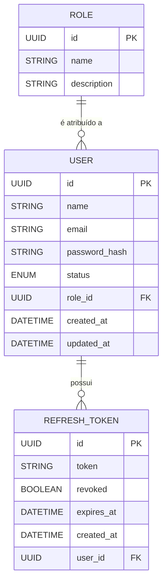

# 📑 Índice

1. [📝 Visão Geral](#visao-geral)
   - [🎯 Objetivo](#objetivo)
   - [📌 Responsabilidades](#responsabilidades)
   - [🚫 Fora do Escopo](#fora-do-escopo)
2. [🗄️ Modelo de Dados](#modelo-de-dados)
   - [📖 Visão Geral](#modelo-visao-geral)
   - [📊 Modelo Conceitual](#modelo-conceitual)
   - [🏛️ Entidades](#entidades)
   - [🔗 Relacionamentos](#relacionamentos)
   - [📐 Regras de Modelagem](#regras-de-modelagem)
3. [🛡️ Papéis (Roles)](#papeis)
   - [📖 Tipos de Papéis](#tipos-de-papeis)
4. [🎫 JWT (JSON Web Token)](#jwt)
   - [🧩 Estrutura do Token](#estrutura-do-token)
   - [📄 Cabeçalho (Header)](#cabecalho-header)
   - [📦 Payload](#payload)
   - [✍️ Assinatura](#assinatura)
   - [📐 Regras de Negócio](#regras-de-negocio-jwt)
   - [🚀 Utilização](#utilizacao)
   - [🔄 Fluxo de Autenticação](#fluxo-de-autenticacao)
5. [📦 Modelos de Requisição e Resposta (DTOs)](#dtos)
   - [📤 Modelos de Requisição](#request-dtos)
      - [CreateUserRequest](#create-user-request)
      - [UpdateUserRequest](#update-user-request)
      - [UpdateUserStatusRequest](#update-user-status-request)
      - [LoginRequest](#login-request)
      - [RefreshTokenRequest](#refresh-token-request)
   - [📥 Modelos de Resposta](#response-dtos)
      - [LoginResponse](#login-response)
      - [RefreshTokenResponse](#refresh-token-response)
      - [UserResponse](#user-response)
      - [Page<UserResponse>](#page-user-response)
      - [MessageResponse](#message-response)
6. [🔐 Autenticação](#autenticacao)
   - [🔑 Login](#login)
   - [♻️ Refresh Token](#refresh-token-endpoint)
   - [🚪 Logout](#logout)
7. [👥 Usuários](#usuarios)
   - [➕ Criar Usuário](#criar-usuario)
   - [📋 Listar Usuários](#listar-usuarios)
   - [🔍 Buscar Usuário](#buscar-usuario)
   - [✏️ Atualizar Usuário](#atualizar-usuario)
   - [🔄 Alterar Status do Usuário](#alterar-status-do-usuario)


---

<a id="visao-geral"></a>

# 📝 Visão Geral

<a id="objetivo"></a>

## 🎯 Objetivo

A Identity Service é o microsserviço responsável pelo gerenciamento da identidade dos usuários da plataforma.

Suas principais responsabilidades incluem autenticação, emissão e renovação de tokens JWT, gerenciamento de usuários e controle de acesso baseado em papéis (RBAC), fornecendo os mecanismos de segurança utilizados pelos demais microsserviços.

---

<a id="responsabilidades"></a>

## 📌 Responsabilidades

A Identity Service é responsável por:

- Autenticar usuários.
- Emitir Access Tokens (JWT).
- Emitir e renovar Refresh Tokens.
- Revogar Refresh Tokens durante o logout.
- Gerenciar usuários.
- Gerenciar papéis de acesso (Roles).
- Fornecer informações de identidade para os demais microsserviços.

---

<a id="fora-do-escopo"></a>

## 🚫 Fora do Escopo

A Identity Service não implementa regras de negócio dos demais microsserviços, incluindo:

- Cadastro de clientes.
- Análise de crédito.
- Auditoria.
- Notificações.
- Gerenciamento de dados financeiros.
- Processamento de solicitações de crédito.


<a id="modelo-de-dados"></a>

# 🗄️ Modelo de Dados

<a id="modelo-visao-geral"></a>

## 📖 Visão Geral

O modelo de dados da Identity Service foi projetado para atender exclusivamente às necessidades de autenticação, autorização e gerenciamento de usuários da plataforma.

O modelo de dados é composto por três entidades:

- **User**: representa um usuário autenticável.
- **Role**: representa o papel atribuído ao usuário.
- **RefreshToken**: representa o token utilizado para renovação de Access Tokens.

---

<a id="modelo-conceitual"></a>

## 📊 Modelo Conceitual

O diagrama abaixo representa as entidades da Identity Service e seus relacionamentos.



<a id="entidades"></a>

## 🏛️ Entidades

### 👤 User

Representa um usuário autenticável da plataforma.

Cada usuário possui exatamente um papel e pode possuir múltiplos Refresh Tokens ao longo do tempo.

#### Responsabilidades

- Identificar o usuário.
- Armazenar as credenciais de autenticação.
- Definir o papel de acesso.
- Controlar o status da conta.

---

### 🛡️ Role

Representa os papéis utilizados para autorização na plataforma.

Os papéis são fixos e cadastrados automaticamente durante a inicialização da aplicação.

#### Papéis Disponíveis

| Papel | Descrição |
|--------|-----------|
| `ADMIN` | Administração da plataforma. |
| `ANALYST` | Operações de análise de crédito. |
| `SYSTEM` | Comunicação entre microsserviços. |

---

### 🔄 Refresh Token

Representa um token persistido utilizado para permitir a emissão de novos Access Tokens sem que o usuário precise realizar uma nova autenticação.

#### Responsabilidades

- Identificar um Refresh Token.
- Controlar sua validade.
- Controlar sua revogação.
- Associar o token a um usuário.

---

## 🔗 Relacionamentos

| Origem | Relacionamento | Destino |
|---------|----------------|---------|
| User | N:1 | Role |
| User | 1:N | RefreshToken |

---

<a id="regras-de-modelagem"></a>

## 📐 Regras de Modelagem

- Cada usuário possui exatamente um papel.
- Um usuário pode possuir múltiplos Refresh Tokens.
- Cada Refresh Token pertence a um único usuário.
- Um papel pode ser atribuído a vários usuários.
- Os papéis são fixos e cadastrados automaticamente pelo Flyway.
- Não existem entidades de Permission ou RolePermission.
- A autorização é baseada exclusivamente no papel presente no JWT.


  

<a id="papeis"></a>

# 🛡️ Papéis (Roles)

A autorização da plataforma é baseada em **RBAC (Role-Based Access Control)**.

Os papéis são fixos, cadastrados automaticamente pelo Flyway durante a inicialização da aplicação e não podem ser gerenciados por meio da API.

---

<a id="tipos-de-papeis"></a>

## 📖 Tipos de Papéis

| Papel | Descrição |
|--------|-----------|
| `ADMIN` | Gerencia usuários e possui acesso administrativo à plataforma. |
| `ANALYST` | Realiza as operações relacionadas à análise de crédito. |
| `SYSTEM` | Utilizado para comunicação entre microsserviços e processos internos da plataforma. |

## 📐 Regras de Negócio

- Os papéis são cadastrados automaticamente pelo Flyway.
- Não existe endpoint para gerenciamento de papéis.
- Cada usuário possui exatamente um papel.
- A autorização é baseada exclusivamente no papel presente no JWT.

---


<a id="jwt"></a>

# 🎫 JWT (JSON Web Token)

O Access Token é um **JSON Web Token (JWT)** emitido pela Identity Service após uma autenticação bem-sucedida.

O token é utilizado pelos microsserviços para autenticação e autorização das requisições protegidas.

---

## 📦 Claims

O JWT contém as seguintes claims:

| Claim | Descrição |
|--------|-----------|
| `sub` | Identificador do usuário. |
| `email` | E-mail do usuário. |
| `role` | Papel atribuído ao usuário. |
| `iat` | Data de emissão do token. |
| `exp` | Data de expiração do token. |

Exemplo:

```json
{
  "sub": "<user_uuid>",
  "email": "<email>",
  "role": "ANALYST",
  "iat": "<issued_at>",
  "exp": "<expires_at>"
}
```

---

## 📐 Regras de Negócio

- O JWT é emitido apenas após uma autenticação bem-sucedida.
- O Access Token possui tempo de expiração limitado.
- O Access Token não é persistido no banco de dados.
- O papel (`role`) presente no token é utilizado pelos microsserviços para autorização.
- O Access Token permanece válido até sua expiração natural.

---

## 🚀 Utilização

Os endpoints protegidos devem receber o Access Token no cabeçalho HTTP:

```http
Authorization: Bearer <access_token>
```


<a id="dtos"></a>

# 📦 Modelos de Requisição e Resposta (DTOs)

Esta seção descreve os modelos de requisição e resposta utilizados pelos endpoints da API.

---

## 📤 Modelos de Requisição (Request DTOs)

<a id="create-user-request"></a>

### CreateUserRequest

Utilizado para criar um novo usuário.

| Campo | Tipo | Obrigatório | Descrição |
|--------|------|:-----------:|-----------|
| `name` | String | Sim | Nome completo do usuário. |
| `email` | String | Sim | E-mail do usuário. |
| `password` | String | Sim | Senha do usuário. |
| `role` | String | Sim | Papel atribuído ao usuário. |

#### Exemplo

```json
{
  "name": "<full_name>",
  "email": "<email>",
  "password": "<password>",
  "role": "ANALYST"
}
```


<a id="update-user-request"></a>

### UpdateUserRequest

Utilizado para atualizar os dados cadastrais de um usuário.

| Campo | Tipo | Obrigatório | Descrição |
|--------|------|:-----------:|-----------|
| `name` | String | Sim | Nome completo do usuário. |
| `email` | String | Sim | E-mail do usuário. |
| `role` | String | Sim | Papel atribuído ao usuário. |

#### Exemplo

```json
{
  "name": "<full_name>",
  "email": "<email>",
  "role": "ADMIN"
}
```
---

<a id="update-user-status-request"></a>

### UpdateUserStatusRequest

Utilizado para alterar o status de um usuário.

| Campo | Tipo | Obrigatório | Descrição |
|--------|------|:-----------:|-----------|
| `status` | Enum | Sim | Novo status do usuário. |

#### Valores permitidos

- `ACTIVE`
- `INACTIVE`
- `BLOCKED`

#### Exemplo

```json
{
  "status": "BLOCKED"
}
```

---

<a id="login-request"></a>

### LoginRequest

Utilizado para autenticar um usuário.

| Campo | Tipo | Obrigatório | Descrição |
|--------|------|:-----------:|-----------|
| `email` | String | Sim | E-mail do usuário. |
| `password` | String | Sim | Senha do usuário. |

#### Exemplo

```json
{
  "email": "<email>",
  "password": "<password>"
}
```

---

<a id="refresh-token-request"></a>

### RefreshTokenRequest

Utilizado pelos endpoints de renovação de token e logout.

| Campo | Tipo | Obrigatório | Descrição |
|--------|------|:-----------:|-----------|
| `refreshToken` | String | Sim | Refresh Token válido. |

#### Exemplo

```json
{
  "refreshToken": "<refresh_token>"
}
```

---

## 📥 Modelos de Resposta (Response DTOs)

<a id="login-response"></a>

### LoginResponse

Retornado após autenticação bem-sucedida.

| Campo | Tipo | Descrição |
|--------|------|-----------|
| `accessToken` | String | JWT utilizado nas requisições autenticadas. |
| `refreshToken` | String | Token utilizado para renovação da sessão. |
| `tokenType` | String | Tipo do token (`Bearer`). |
| `expiresIn` | Integer | Tempo de expiração do Access Token em segundos. |

#### Exemplo

```json
{
  "accessToken": "<access_token>",
  "refreshToken": "<refresh_token>",
  "tokenType": "Bearer",
  "expiresIn": 900
}
```

---

<a id="refresh-token-response"></a>

### RefreshTokenResponse

Retornado após a renovação de um Access Token.

| Campo | Tipo | Descrição |
|--------|------|-----------|
| `accessToken` | String | Novo JWT. |
| `refreshToken` | String | Novo Refresh Token. |
| `tokenType` | String | Tipo do token (`Bearer`). |
| `expiresIn` | Integer | Tempo de expiração do Access Token em segundos. |

#### Exemplo

```json
{
  "accessToken": "<new_access_token>",
  "refreshToken": "<new_refresh_token>",
  "tokenType": "Bearer",
  "expiresIn": 900
}
```

---

<a id="user-response"></a>

### UserResponse

Representa os dados de um usuário retornados pela API.

| Campo | Tipo | Descrição |
|--------|------|-----------|
| `id` | UUID | Identificador do usuário. |
| `name` | String | Nome completo. |
| `email` | String | E-mail. |
| `role` | String | Papel atribuído ao usuário. |
| `status` | Enum | Status do usuário. |

#### Exemplo

```json
{
  "id": "<user_uuid>",
  "name": "<full_name>",
  "email": "<email>",
  "role": "ANALYST",
  "status": "ACTIVE"
}
```

---

<a id="page-user-response"></a>

### Page<UserResponse>

Representa uma resposta paginada utilizando o padrão do Spring Data.

| Campo | Tipo | Descrição |
|--------|------|-----------|
| `content` | List<UserResponse> | Lista de usuários. |
| `page` | Integer | Página atual. |
| `size` | Integer | Quantidade de registros por página. |
| `totalElements` | Long | Total de registros encontrados. |
| `totalPages` | Integer | Total de páginas disponíveis. |

#### Exemplo

```json
{
  "content": [
    {
      "id": "<user_uuid>",
      "name": "<full_name>",
      "email": "<email>",
      "role": "ANALYST",
      "status": "ACTIVE"
    }
  ],
  "page": 0,
  "size": 10,
  "totalElements": 100,
  "totalPages": 10
}
```

---

<a id="message-response"></a>

### MessageResponse

Representa uma resposta simples contendo apenas uma mensagem descritiva da operação executada.

#### Estrutura

| Campo | Tipo | Descrição |
|--------|------|-----------|
| `message` | String | Mensagem retornada pela API. |

#### Exemplo

```json
{
  "message": "<message>"
}
```

#### Utilizado por

- `POST /api/v1/auth/logout`
- Endpoints administrativos que retornam apenas a confirmação da operação.


<a id="autenticacao"></a>

# 🔐 Autenticação

Esta seção documenta os endpoints responsáveis pela autenticação dos usuários, emissão de tokens, renovação de sessão e encerramento da autenticação.

---

<a id="login"></a>

## 🔑 Login

### Objetivo

Autenticar um usuário e emitir os tokens necessários para acesso à plataforma.

### Endpoint

```http
POST /api/v1/auth/login
```

### Autenticação

Não requerida.

### Cabeçalhos

| Nome | Obrigatório | Valor |
|------|:-----------:|-------|
| `Content-Type` | Sim | `application/json` |

### Corpo da Requisição

DTO: `LoginRequest`

Exemplo:

```json
{
  "email": "<email>",
  "password": "<password>"
}
```

### Resposta de Sucesso

DTO: `LoginResponse`

Exemplo:

```json
{
  "accessToken": "<access_token>",
  "refreshToken": "<refresh_token>",
  "tokenType": "Bearer",
  "expiresIn": "<expires_in>"
}
```

### Regras de Negócio

- O usuário deve estar cadastrado.
- O usuário deve possuir status `ACTIVE`.
- A senha informada deve corresponder ao hash armazenado.
- Após uma autenticação bem-sucedida, são emitidos um Access Token e um Refresh Token.

### Códigos HTTP

| Código | Descrição |
|---------|-----------|
| `200 OK` | Autenticação realizada com sucesso. |
| `400 Bad Request` | Requisição inválida. |
| `401 Unauthorized` | Credenciais inválidas. |
| `500 Internal Server Error` | Erro interno do servidor. |

---


<a id="refresh-token-endpoint"></a>

## ♻️ Refresh Token

### Objetivo

Emitir um novo Access Token utilizando um Refresh Token válido.

### Endpoint

```http
POST /api/v1/auth/refresh
```

### Autenticação

Não requerida.

### Cabeçalhos

| Nome | Obrigatório | Valor |
|------|:-----------:|-------|
| `Content-Type` | Sim | `application/json` |

### Corpo da Requisição

DTO: `RefreshTokenRequest`

Exemplo:

```json
{
  "refreshToken": "<refresh_token>"
}
```

### Resposta de Sucesso

DTO: `RefreshTokenResponse`

Exemplo:

```json
{
  "accessToken": "<access_token>",
  "refreshToken": "<refresh_token>",
  "tokenType": "Bearer",
  "expiresIn": "<expires_in>"
}
```

### Regras de Negócio

- O Refresh Token deve ser válido.
- O Refresh Token não pode estar expirado.
- O Refresh Token não pode estar revogado.
- Após a renovação, um novo Access Token e um novo Refresh Token são emitidos.
- O Refresh Token utilizado é imediatamente revogado (Refresh Token Rotation).

### Códigos HTTP

| Código | Descrição |
|---------|-----------|
| `200 OK` | Novo Access Token emitido com sucesso. |
| `400 Bad Request` | Requisição inválida. |
| `401 Unauthorized` | Refresh Token inválido, expirado ou revogado. |
| `500 Internal Server Error` | Erro interno do servidor. |

---

<a id="logout"></a>

## 🚪 Logout

### Objetivo

Encerrar a sessão do usuário revogando o Refresh Token utilizado.

### Endpoint

```http
POST /api/v1/auth/logout
```

### Autenticação

Obrigatória (`Bearer Token`).

### Cabeçalhos

| Nome | Obrigatório | Valor |
|------|:-----------:|-------|
| `Authorization` | Sim | `Bearer <access_token>` |
| `Content-Type` | Sim | `application/json` |

### Corpo da Requisição

DTO: `RefreshTokenRequest`

Exemplo:

```json
{
  "refreshToken": "<refresh_token>"
}
```

### Resposta de Sucesso

DTO: `MessageResponse`

Exemplo:

```json
{
  "message": "Logout realizado com sucesso."
}
```

### Regras de Negócio

- O Access Token deve ser válido.
- O Refresh Token deve pertencer ao usuário autenticado.
- O Refresh Token é revogado e não pode mais ser reutilizado.
- O Access Token permanece válido até sua expiração natural.

### Códigos HTTP

| Código | Descrição |
|---------|-----------|
| `200 OK` | Logout realizado com sucesso. |
| `400 Bad Request` | Requisição inválida. |
| `401 Unauthorized` | Access Token inválido ou expirado. |
| `500 Internal Server Error` | Erro interno do servidor. |

---


## 🔄 Fluxo de Autenticação

```text


            ┌───────────────┐
            │     Login     │
            └───────┬───────┘
                    │
                    ▼
          Identity Service
                    │
        ┌───────────┴───────────┐
        ▼                       ▼
 Access Token (JWT)      Refresh Token
        │                       │
        └───────────┬───────────┘
                    ▼
     Cliente realiza requisições
                    │
                    ▼
      Access Token expirou?
             │
      ┌──────┴──────┐
      ▼             ▼
    Não            Sim
      │             │
      ▼             ▼
 Continua      POST /auth/refresh
 utilizando           │
  o Access            ▼
    Token     Novo Access Token
              Novo Refresh Token


```

<a id="usuarios"></a>

# 👥 Usuários

Esta seção documenta os endpoints responsáveis pelo gerenciamento dos usuários da plataforma, incluindo criação, consulta, atualização e alteração de status.

---

<a id="criar-usuario"></a>

## ➕ Criar Usuário

### Objetivo

Cadastrar um novo usuário na plataforma.

### Endpoint

```http
POST /api/v1/users
```

### Autenticação

Obrigatória (`Bearer Token`).

### Permissão

`ADMIN`

### Cabeçalhos

| Nome | Obrigatório | Valor |
|------|:-----------:|-------|
| `Authorization` | Sim | `Bearer <access_token>` |
| `Content-Type` | Sim | `application/json` |

### Corpo da Requisição

DTO: `CreateUserRequest`

Exemplo:

```json
{
  "name": "<name>",
  "email": "<email>",
  "password": "<password>",
  "role": "<role>"
}
```

### Resposta de Sucesso

DTO: `UserResponse`

Exemplo:

```json
{
  "id": "<user_uuid>",
  "name": "<name>",
  "email": "<email>",
  "status": "ACTIVE",
  "role": "<role>",
  "createdAt": "<created_at>",
  "updatedAt": "<updated_at>"
}
```

### Regras de Negócio

- Apenas usuários com papel `ADMIN` podem criar usuários.
- O e-mail deve ser único.
- O papel informado deve existir.
- Todo usuário é criado com status `ACTIVE`.
- A senha é armazenada utilizando algoritmo de hash.

### Códigos HTTP

| Código | Descrição |
|---------|-----------|
| `201 Created` | Usuário criado com sucesso. |
| `400 Bad Request` | Dados inválidos. |
| `403 Forbidden` | Usuário sem permissão. |
| `409 Conflict` | E-mail já cadastrado. |
| `500 Internal Server Error` | Erro interno do servidor. |

---


<a id="listar-usuarios"></a>

## 📋 Listar Usuários

### Objetivo

Listar os usuários cadastrados de forma paginada.

### Endpoint

```http
GET /api/v1/users
```

### Autenticação

Obrigatória (`Bearer Token`).

### Permissão

`ADMIN`

### Cabeçalhos

| Nome | Obrigatório | Valor |
|------|:-----------:|-------|
| `Authorization` | Sim | `Bearer <access_token>` |

### Parâmetros de Consulta

| Nome | Tipo | Obrigatório | Padrão | Descrição |
|------|------|:-----------:|--------|-----------|
| `page` | Integer | Não | `0` | Número da página. |
| `size` | Integer | Não | `10` | Quantidade de registros por página. |
| `sort` | String | Não | `name,asc` | Campo e direção da ordenação. |

### Resposta de Sucesso

DTO: `Page<UserResponse>`

Exemplo:

```json
{
  "content": [
    {
      "id": "<user_uuid>",
      "name": "<name>",
      "email": "<email>",
      "status": "<status>",
      "role": "<role>",
      "createdAt": "<created_at>",
      "updatedAt": "<updated_at>"
    }
  ],
  "page": {
    "size": 10,
    "number": 0,
    "totalElements": "<total_elements>",
    "totalPages": "<total_pages>"
  }
}
```

### Regras de Negócio

- Apenas usuários com papel `ADMIN` podem listar usuários.
- A listagem é paginada utilizando Spring Data.

### Códigos HTTP

| Código | Descrição |
|---------|-----------|
| `200 OK` | Consulta realizada com sucesso. |
| `403 Forbidden` | Usuário sem permissão. |
| `500 Internal Server Error` | Erro interno do servidor. |

---

<a id="buscar-usuario"></a>

## 🔍 Buscar Usuário

### Objetivo

Consultar um usuário pelo identificador.

### Endpoint

```http
GET /api/v1/users/{id}
```

### Autenticação

Obrigatória (`Bearer Token`).

### Permissão

`ADMIN`

### Cabeçalhos

| Nome | Obrigatório | Valor |
|------|:-----------:|-------|
| `Authorization` | Sim | `Bearer <access_token>` |

### Parâmetros de Caminho

| Nome | Tipo | Obrigatório | Descrição |
|------|------|:-----------:|-----------|
| `id` | UUID | Sim | Identificador do usuário. |

### Resposta de Sucesso

DTO: `UserResponse`

Exemplo:

```json
{
  "id": "<user_uuid>",
  "name": "<name>",
  "email": "<email>",
  "status": "<status>",
  "role": "<role>",
  "createdAt": "<created_at>",
  "updatedAt": "<updated_at>"
}
```

### Regras de Negócio

- Apenas usuários com papel `ADMIN` podem consultar usuários.
- O usuário deve existir.

### Códigos HTTP

| Código | Descrição |
|---------|-----------|
| `200 OK` | Usuário encontrado. |
| `403 Forbidden` | Usuário sem permissão. |
| `404 Not Found` | Usuário não encontrado. |
| `500 Internal Server Error` | Erro interno do servidor. |

---

<a id="atualizar-usuario"></a>

## ✏️ Atualizar Usuário

### Objetivo

Atualizar os dados cadastrais de um usuário.

### Endpoint

```http
PUT /api/v1/users/{id}
```

### Autenticação

Obrigatória (`Bearer Token`).

### Permissão

`ADMIN`

### Cabeçalhos

| Nome | Obrigatório | Valor |
|------|:-----------:|-------|
| `Authorization` | Sim | `Bearer <access_token>` |
| `Content-Type` | Sim | `application/json` |

### Parâmetros de Caminho

| Nome | Tipo | Obrigatório | Descrição |
|------|------|:-----------:|-----------|
| `id` | UUID | Sim | Identificador do usuário. |

### Corpo da Requisição

DTO: `UpdateUserRequest`

Exemplo:

```json
{
  "name": "<name>",
  "email": "<email>",
  "role": "<role>"
}
```

### Resposta de Sucesso

DTO: `UserResponse`

Exemplo:

```json
{
  "id": "<user_uuid>",
  "name": "<name>",
  "email": "<email>",
  "status": "<status>",
  "role": "<role>",
  "createdAt": "<created_at>",
  "updatedAt": "<updated_at>"
}
```

### Regras de Negócio

- Apenas usuários com papel `ADMIN` podem atualizar usuários.
- Apenas `name`, `email` e `role` podem ser alterados.
- O status do usuário não pode ser alterado neste endpoint.
- O e-mail deve permanecer único.

### Códigos HTTP

| Código | Descrição |
|---------|-----------|
| `200 OK` | Usuário atualizado com sucesso. |
| `400 Bad Request` | Dados inválidos. |
| `403 Forbidden` | Usuário sem permissão. |
| `404 Not Found` | Usuário não encontrado. |
| `409 Conflict` | E-mail já utilizado. |
| `500 Internal Server Error` | Erro interno do servidor. |

---

<a id="alterar-status-do-usuario"></a>

## 🔄 Alterar Status do Usuário

### Objetivo

Alterar o status de um usuário.

### Endpoint

```http
PATCH /api/v1/users/{id}/status
```

### Autenticação

Obrigatória (`Bearer Token`).

### Permissão

`ADMIN`

### Cabeçalhos

| Nome | Obrigatório | Valor |
|------|:-----------:|-------|
| `Authorization` | Sim | `Bearer <access_token>` |
| `Content-Type` | Sim | `application/json` |

### Parâmetros de Caminho

| Nome | Tipo | Obrigatório | Descrição |
|------|------|:-----------:|-----------|
| `id` | UUID | Sim | Identificador do usuário. |

### Corpo da Requisição

DTO: `UpdateUserStatusRequest`

Exemplo:

```json
{
  "status": "<status>"
}
```

### Resposta de Sucesso

DTO: `UserResponse`

Exemplo:

```json
{
  "id": "<user_uuid>",
  "name": "<name>",
  "email": "<email>",
  "status": "<status>",
  "role": "<role>",
  "createdAt": "<created_at>",
  "updatedAt": "<updated_at>"
}
```

### Regras de Negócio

- Apenas usuários com papel `ADMIN` podem alterar o status de usuários.
- Os status permitidos são:
  - `ACTIVE`
  - `INACTIVE`
  - `BLOCKED`
- Apenas o status pode ser alterado por este endpoint.

### Códigos HTTP

| Código | Descrição |
|---------|-----------|
| `200 OK` | Status alterado com sucesso. |
| `400 Bad Request` | Status inválido. |
| `403 Forbidden` | Usuário sem permissão. |
| `404 Not Found` | Usuário não encontrado. |
| `500 Internal Server Error` | Erro interno do servidor. |

---

<a id="alterar-status-do-usuario"></a>

## 🔄 Alterar Status do Usuário

### Objetivo

Alterar o status de um usuário.

### Endpoint

```http
PATCH /api/v1/users/{id}/status
```

### Autenticação

Obrigatória (`Bearer Token`).

### Permissão

`ADMIN`

### Cabeçalhos

| Nome | Obrigatório | Valor |
|------|:-----------:|-------|
| `Authorization` | Sim | `Bearer <access_token>` |
| `Content-Type` | Sim | `application/json` |

### Parâmetros de Caminho

| Nome | Tipo | Obrigatório | Descrição |
|------|------|:-----------:|-----------|
| `id` | UUID | Sim | Identificador do usuário. |

### Corpo da Requisição

DTO: `UpdateUserStatusRequest`

Exemplo:

```json
{
  "status": "<status>"
}
```

### Resposta de Sucesso

DTO: `UserResponse`

Exemplo:

```json
{
  "id": "<user_uuid>",
  "name": "<name>",
  "email": "<email>",
  "status": "<status>",
  "role": "<role>",
  "createdAt": "<created_at>",
  "updatedAt": "<updated_at>"
}
```

### Regras de Negócio

- Apenas usuários com papel `ADMIN` podem alterar o status de usuários.
- Os status permitidos são:
  - `ACTIVE`
  - `INACTIVE`
  - `BLOCKED`
- Apenas o status pode ser alterado por este endpoint.

### Códigos HTTP

| Código | Descrição |
|---------|-----------|
| `200 OK` | Status alterado com sucesso. |
| `400 Bad Request` | Status inválido. |
| `403 Forbidden` | Usuário sem permissão. |
| `404 Not Found` | Usuário não encontrado. |
| `500 Internal Server Error` | Erro interno do servidor. |

---


